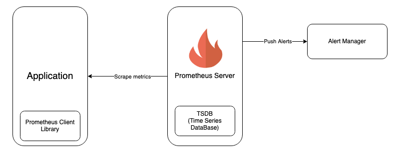
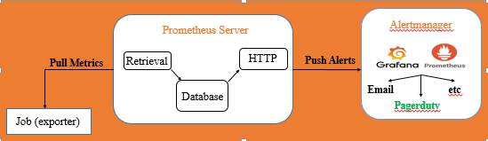

## Tổng quan về prometheus

### Mục lục

[1. Tổng quan](#tongquan)<br>
[2. Khái niệm](#khainiem)<br>
[3. Kiến trúc](#kientruc)<br>
[4. Các loại metric](#metric)<br>

<a name="tongquan"></a>
## 1. Tổng quan

- `PUSH` và `FULL` trong giám sát

+ `PUSH` metric có nghĩa là khi đó trách nhiệm thu thập dữ liệu (scaping) từ các dịch vụ cần giám sát về máy chủ giám sát phụ thuộc vào các agent trên các máy client, mỗi khi có thay đổi dữ liệu các agent sẽ chủ động đẩy đến máy chủ giám sát

-> Agent có trách nhiệm đẩy metric và cập nhật sự thay đổi của metric về server giám sát.

+ `FULL` metric có nghĩa là lúc này trách nhiệm thu thập dữ liệu (scaping) từ các dịch vụ cần giám sát thuộc về máy chủ giám sát.

-> Máy chủ giám sát có trách nhiệm chủ động thu thập metric về mình.

- `Prometheus` là một hệ thống giám sát và cảnh báo. Là một dự án mã nguồn mở được phát triển bởi SoundCloud vào năm 2012 và được ấp ủ bở cộng đồng Cloud Native Computing Foundation. Prometheus có khả năng thu thập các metrics từ các targets được cấu hình theo các khoảng thời gian nhất định.

- Prometheus là một công cụ monitor server mã nguồn mở với cơ sở dữ liệu theo thời gian thực (An opensource  time series database).

- Time series database là những database được lưu trữ theo các mốc thời gian. Mỗi dữ liệu luôn được gắn tag với một mốc thời gian nên có thể xem lại dữ liệu theo các mốc thời gian trước đó.

<a name="khainiem"></a>
## 2. Khái niệm

- `Client Libraries`: Metrics không thể tự xuất hiện từ các ứng dụng cần phải có một thành phần để biểu thị ở một dạng có nghĩa, lúc này cần đến client libraries.

Client libraries hỗ trợ rất nhiều các ngôn ngữ, prometheus cung cấp client libraries cho Go, Python, Java/JVM và Ruby. Ngoài ra còn hỗ trợ các loại thư viện bên thứ 3 như C#/.NET, NodeJS, Haskell, Erlang và Rust.

- `Exporters:` Exporter là một chương trình với mục đích thu thập, phân tích và chuyển đổi các dữ liệu chưa đúng chuẩn prometheus sang đúng chuẩn prometheus và hỗ trợ việc phơi các thông tin metrics ra web service api.


- `Scrapes:` Service discovery và relabeling cung cấp các targets cần được giám sát. Prometheus cần phải có các metrics để giám sát, prometheus sẽ gửi một request HTTP được gọi là scrape, phản hồi nhận được từ scape được phân tích và lưu trữ tại storage. Một số metrics hữu ích cũng được thêm vào, khoảng cách của một lần scrape phụ thuộc vào cấu hình trên prometheus.

- `Storage`: Prometheus lưu trữ dữ liệu tại local bên trong một custom db.

- `Metrics names and labels`: Mỗi time series được xác định duy nhất bởi tên metrics và một cặp key-value, còn được gọi là label.

**Metric name:** Chỉ định các thông số của hệ thống, ví dụ như http_requests_total - Tổng số request HTTP đã nhận.

**Labels:** Bất kỳ sự kết hợp label nào.

<a name="kientruc"></a>
## 3. Kiến trúc




- Các thành phần cấu thành prometheus bao gồm:

```
Prometheus Server - Nơi scapes và lưu trữ metrics
Client Library - Tính toán và hiển thị các thông tin metrics
Alert Manager - Phục vụ việc cảnh báo
```
Còn một thành phần nữa của prometheus là `push gateways` không có trong mô hình ở trên dưới.



Prometheus thực hiện pull các metric từ các job (exporter). Sau đấy prometheus sẽ lưu trữ các dữ liệu thu thập được ở chính máy chủ cài prometheus server. Tiếp đến sẽ chạy các rule để xử lý các dữ liệu theo nhu cầu cũng như kiểm tra thực hiện các cảnh báo mong muốn.

<a name="metric"></a>
## 4.Các loại metric

### 4.1.Counter

Sử dụng `counter` khi giá trị cần lấy là giá trị chỉ tăng, giống như là request count hoặc error count.

Khi nào thì sử dụng counter: Khi cần lấy giá trị mà nó chỉ tăng theo thời gian, muốn truy vấn xem giá trị này tăng nhanh như thế nào.

### 4.2. Gauges

`Gauge metric` là loại mà giá trị muốn lấy có thể tăng giảm bất kỳ lúc nào giống như RAM Used hoặc là số lượng item trong hàng chờ.

Khi nào thì sử dụng gauge: Khi chúng ta muốn lấy một giá trị có thể tăng hoặc giảm, không cần query mức độ tăng trưởng.

### 4.3. Histograms

Loại metric này khi chúng ta cần đo tần suất của một giá trị nào đó theo những khoảng giá trị cụ thể được định ra trước đó.

Ví dụ:

```
# HELP http_request_duration_milliseconds Http request latency histogram
# TYPE http_request_duration_milliseconds histogram
http_request_duration_milliseconds_bucket{le="100"} 3741
http_request_duration_milliseconds_bucket{le="200"} 4597
http_request_duration_milliseconds_bucket{le="400"} 4747
http_request_duration_milliseconds_bucket{le="800"} 4978
```

Như dữ liệu bên trên chúng ta có thể được số lượng request có resp từ 100ms trở xuống là 3741, số lượng request có resp từ 200ms trở xuống là 4597.

Với histogram tất cả các số liệu này sẽ được tính toán tại Prometheus server.

### 4.4. Summaries

Histograms nhưng các tính toán lại ở phía client.

Ví dụ:

```
# HELP go_gc_duration_seconds A summary of the GC invocation durations.
# TYPE go_gc_duration_seconds summary
go_gc_duration_seconds{quantile="0"} 4.274e-05
go_gc_duration_seconds{quantile="0.25"} 6.8508e-05
go_gc_duration_seconds{quantile="0.5"} 0.000275171
```


### Tham khảo

https://blog.pvincent.io/2017/12/prometheus-blog-series-part-2-metric-types/

https://www.fosslinux.com/10398/how-to-install-and-configure-prometheus-on-centos-7.htm


