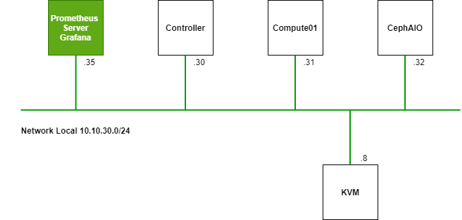
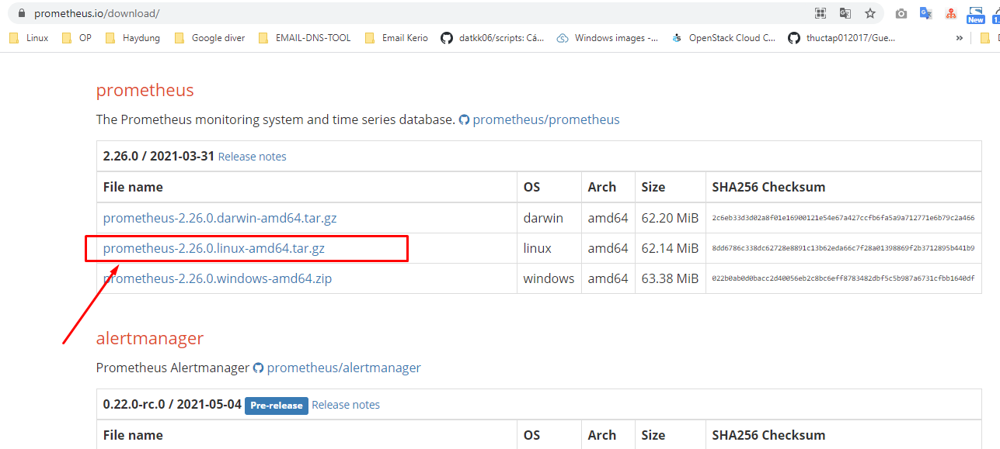
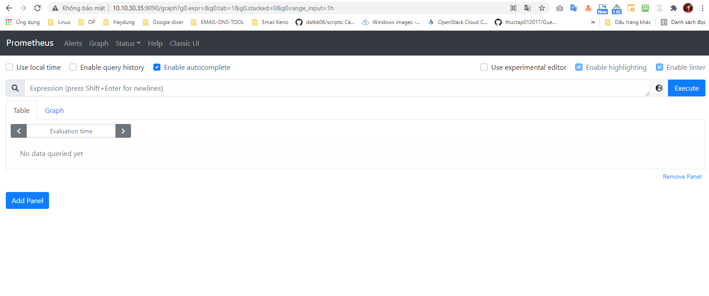
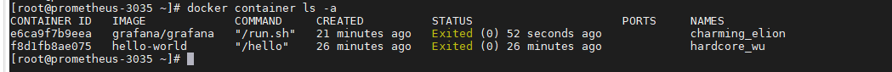
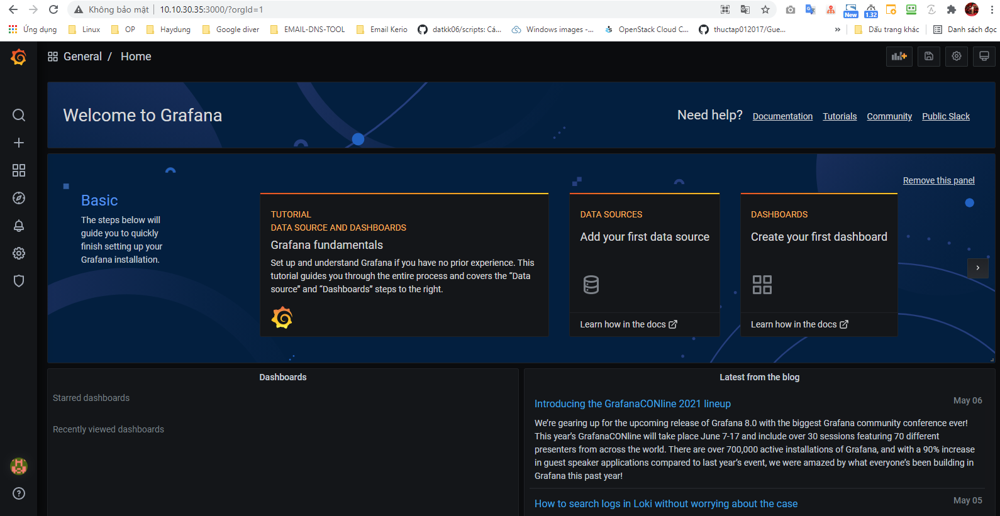
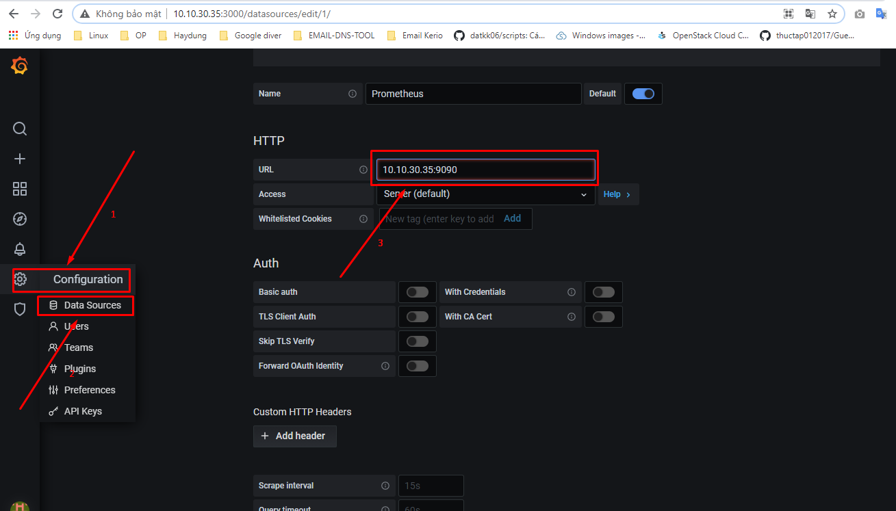
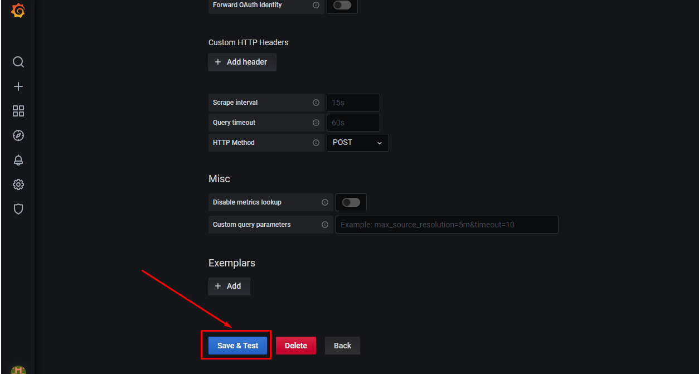
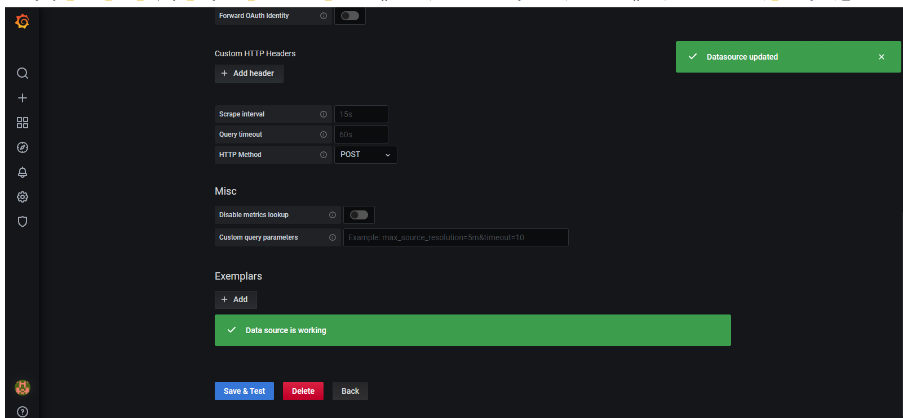

## Cài đặt prometheus trên CentOS7

### Mục lục

[1. Thiết lập ban đầu](#thietlap)<br>
[2. Cài đặt prometheus](#caidat)<br>
[3. Cài đặt grafana - docker](#grafana)<br>



<a name="thietlap"></a>
## 1. Thiết lập ban đầu

**Thiết lập IP**

```
hostnamectl set-hostname prometheus-3035
sudo systemctl disable firewalld
sudo systemctl stop firewalld
sudo systemctl disable NetworkManager
sudo systemctl stop NetworkManager
sudo systemctl enable network
sudo systemctl start network
sed -i 's/SELINUX=enforcing/SELINUX=disabled/g' /etc/sysconfig/selinux
sed -i 's/SELINUX=enforcing/SELINUX=disabled/g' /etc/selinux/config
init 6
```

```
yum install epel-release -y
yum update -y
yum install wget -y
```

**Cài đặt NTPD**


```
yum install chrony -y 

systemctl start chronyd 
systemctl enable chronyd
systemctl restart chronyd 

chronyc sources -v
```

```
sudo date -s "$(wget -qSO- --max-redirect=0 google.com 2>&1 | grep Date: | cut -d' ' -f5-8)Z"
ln -f -s /usr/share/zoneinfo/Asia/Ho_Chi_Minh /etc/localtime
```

**CMD log**

```
curl -Lso- https://raw.githubusercontent.com/nhanhoadocs/ghichep-cmdlog/master/cmdlog.sh | bash
```

<a name="caidat"></a>
## 2. Cài đặt Prometheus

**Download Prometheus package**

Tải package <a href="https://prometheus.io/download/" target="_blank">tại đây!</a>



```
wget https://github.com/prometheus/prometheus/releases/download/v2.26.0/prometheus-2.26.0.linux-amd64.tar.gz
```

**Configure Prometheus**

- Add user Prometheus

```
useradd --no-create-home --shell /bin/false prometheus
```

- Tạo các thư mục cần thiết

```
mkdir /etc/prometheus
mkdir /var/lib/prometheus
```

- Phân quyền cho các thư mục tạo ở trên

```
chown prometheus:prometheus /etc/prometheus
chown prometheus:prometheus /var/lib/prometheus
```

- Giải nén prometheus package vừa tải về

```
tar -xvzf prometheus-2.26.0.linux-amd64.tar.gz
```

```
mv prometheus-2.26.0.linux-amd64 prometheuspackage
```

- Copy `prometheus` và `promtool` binary từ `prometheuspackage` tới `/usr/local/bin`

```
cp prometheuspackage/prometheus /usr/local/bin/
cp prometheuspackage/promtool /usr/local/bin/
```

- Set owner bởi prometheus user

```
chown prometheus:prometheus /usr/local/bin/prometheus
chown prometheus:prometheus /usr/local/bin/promtool
```

- Copy `consoles` và `console_libraries` từ `prometheuspackage` tới `/etc/prometheus folder`

```
cp -r prometheuspackage/consoles /etc/prometheus
cp -r prometheuspackage/console_libraries /etc/prometheus
```

- Set owner bởi prometheus user

```
chown -R prometheus:prometheus /etc/prometheus/consoles
chown -R prometheus:prometheus /etc/prometheus/console_libraries
```

- Thêm và chỉnh sửa prometheus configuration file

```
vi /etc/prometheus/prometheus.yml
```

Thêm nội dung

```
global:
  scrape_interval: 10s

scrape_configs:
  - job_name: 'prometheus_master'
    scrape_interval: 5s
    static_configs:
      - targets: ['localhost:9090']
```

- Phân quyền user prometheus

```
chown prometheus:prometheus /etc/prometheus/prometheus.yml
```

- Cấu hình Prometheus Service File

```
vi /etc/systemd/system/prometheus.service
```

Thêm nội dung

```
[Unit]
Description=Prometheus
Wants=network-online.target
After=network-online.target

[Service]
User=prometheus
Group=prometheus
Type=simple
ExecStart=/usr/local/bin/prometheus \
--config.file /etc/prometheus/prometheus.yml \
--storage.tsdb.path /var/lib/prometheus/ \
--web.console.templates=/etc/prometheus/consoles \
--web.console.libraries=/etc/prometheus/console_libraries

[Install]
WantedBy=multi-user.target
```

- Reload systemd service

```
systemctl daemon-reload
systemctl start prometheus
systemctl enable prometheus
systemctl status prometheus
```

**Access Prometheus Web Interface**

```
http://Server-IP:9090/graph
```

```
http://10.10.30.35:9090/graph
```




<a name="grafana"></a>
## 3. Cài đặt grafana - docker

Để hiển thị metric từ prometheus lên grafana có thể cài đặt tách riêng grafana hoặc cài đặt docker grafana luôn lên server chạy prometheus.

- Setup docker trên CentOS 7

```
sudo yum install -y yum-utils device-mapper-persistent-data lvm2
```

```
sudo yum-config-manager --add-repo https://download.docker.com/linux/centos/docker-ce.repo
```

```
sudo yum install -y docker-ce docker-ce-cli containerd.io
```

```
systemctl start docker
systemctl enable docker
systemctl status docker
docker -v
```


Hoặc cài đặt bằng cách

```
curl -fsSL https://get.docker.com/ | sh
systemctl start docker
```

- Setup grafana docker version lastest

```
docker run -d -p 3000:3000 grafana/grafana
```

Nếu muốn chỉ định version thực hiện câu lệnh ở dưới

```
docker run -d -p 3001:3000 --name grafana grafana/grafana:6.5.0
```

```
docker ps
```

```
docker start e6ca9f7b9eea
docker exec e6ca9f7b9eea bash -c "grafana-cli plugins install yesoreyeram-boomtable-panel"
docker stop e6ca9f7b9eea
docker start e6ca9f7b9eea
docker restart e6ca9f7b9eea
docker exec e6ca9f7b9eea bash -c "grafana-server -v"
```

List các container trong docker

```
docker container ls -a
```



Xem log container

```
docker container logs -f ID_Contrainer
```

- Truy cập giao diện web `http://IP-Grafana:3000/` `http://10.10.30.35:3000/`  với thông tin `admin/admin`



- Add datasource prometheus lên grafana








### Tham khảo

https://blog.pvincent.io/2017/12/prometheus-blog-series-part-2-metric-types/

https://www.fosslinux.com/10398/how-to-install-and-configure-prometheus-on-centos-7.htm

https://prometheus.io/docs/prometheus/latest/querying/basics/

