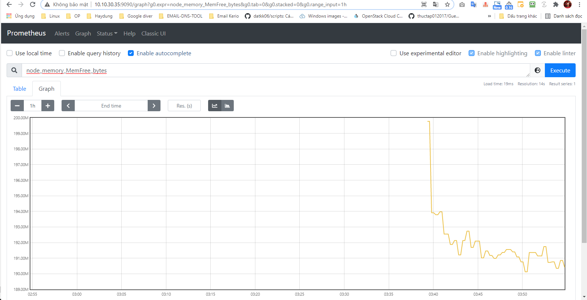

## Monitor Linux Server sử dụng Prometheus

### Mục lục

[1. Cài đặt exporter](#exporter)<br>
[2. Thêm config node exporter target trên prometheus server](#target)<br>
[3. Hiển thị monitor linux server lên grafana](#linux)<br>

<a name="exporter"></a>
## 1. Cài đặt exporter

- Cần phải có cấu hình prometheus node exporter trên server linux cần giám sát

Tải node exporter <a href="https://prometheus.io/download/" target="_blank">tại đây!</a>


```
wget https://github.com/prometheus/node_exporter/releases/download/v1.1.2/node_exporter-1.1.2.linux-amd64.tar.gz
```

- Giải nén package vừa download

```
tar -xvzf node_exporter-1.1.2.linux-amd64.tar.gz
```

- Tạo một user cho node exporter

```
useradd -rs /bin/false nodeusr
```

- Chuyển binary tới `/usr/local/bin` từ package vừa giải nén.

```
mv node_exporter-1.1.2.linux-amd64/node_exporter /usr/local/bin/
```

- Tạo một service file cho node exporter.

```
vi /etc/systemd/system/node_exporter.service
```

Thêm nội dung

```
[Unit]
Description=Node Exporter
After=network.target

[Service]
User=nodeusr
Group=nodeusr
Type=simple
ExecStart=/usr/local/bin/node_exporter

[Install]
WantedBy=multi-user.target
```
- Reload system daemon

```
systemctl daemon-reload
systemctl start node_exporter
systemctl enable node_exporter
systemctl status node_exporter
```

- Xem metrics thu thập được qua node exporter URL.

```
http://IP-Server-Linux:9100/metrics
```

```
http://10.10.30.30:9100/metrics
```


<a name="target"></a>
## 2. Thêm config node exporter target trên prometheus server

- Chỉnh sửa file `prometheus.yml` trên prometheus server 

```
vi /etc/prometheus/prometheus.yml
```

Thêm đoạn cấu hình (lưu ý đúng cú pháp yaml)

```
 - job_name: 'node_exporter_openstack'
    scrape_interval: 30s
    static_configs:
      - targets: ['10.10.30.30:9100']
```


- Restart Prometheus service

```
systemctl restart prometheus
```

- Truy cập xem target server linux

```
http://Prometheus-Server-IP:9090/targets
```


- Query metric trên giao diện



<a name="linux"></a>
## 3. Hiển thị monitor linux server lên grafana

Import file json tùy chỉnh cấu hình với hệ thống cần monitor


