## Monitor một số tham số Openstack sử dụng prometheus


- Cài đặt `openstack-exporter-linux` trên node prometheus server


```
yum install git -y
```

```
cd /opt/
git clone https://github.com/openstack-exporter/openstack-exporter.git

cd openstack-exporter/
```

```
docker pull quay.io/niedbalski/openstack-exporter-linux-amd64:master
docker pull quay.io/niedbalski/openstack-exporter-linux-amd64:v1.3.0
```

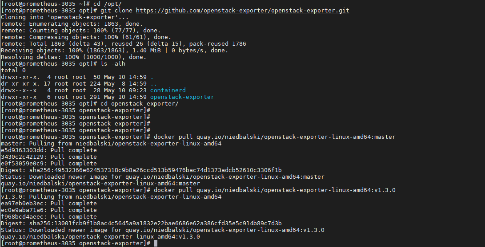

- Tạo file `clouds.yml`

```
mkdir -p /root/.config/openstack/
```

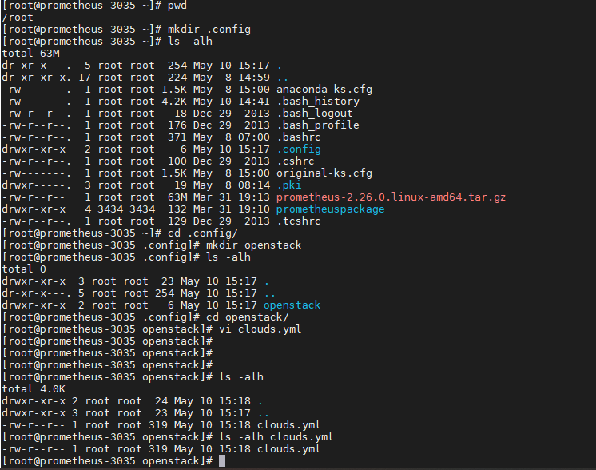

```
vi /root/.config/openstack/clouds.yml
```

Thêm cấu hình các thông tin xác thực về hệ thống OPS

```
clouds:
  10.10.30.30:
    region_name: RegionOne
    identity_api_version: 3
    identity_interface: internal
    auth:
      username: 'admin'
      password: 'Welcome123'
      project_name: 'admin'
      project_domain_name: 'Default'
      user_domain_name: 'Default'
      auth_url: 'http://10.10.30.30:35357/v3'
```

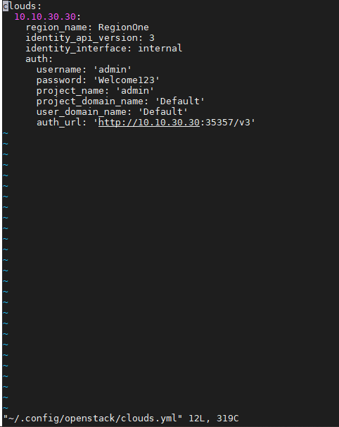

Đưa vào byobu chạy lệnh dưới (khá lâu khoảng 1h mới run metrics)

```
docker run -v "$HOME/.config/openstack/clouds.yml":/etc/openstack/clouds.yaml -it quay.io/niedbalski/openstack-exporter-linux-amd64:master 10.10.30.30
```

`10.10.30.30` trong câu lệnh trên chính là tham số dòng thứ 2 trong file `/root/.config/openstack/clouds.yml`

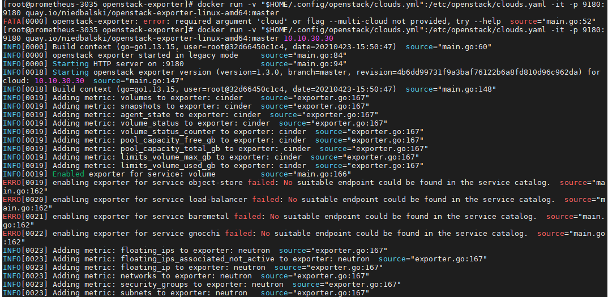

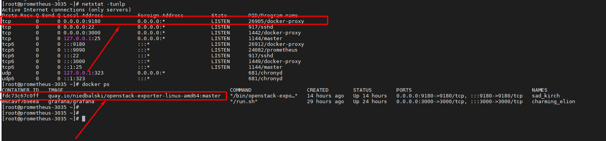

- Chỉnh sửa file cấu hình prometheus.yml trên prometheus server

```
vi /etc/prometheus/prometheus.yml
```

Thêm dòng

```
  - job_name: 'openstack_RegionOne'
    scrape_interval: 15m
    scrape_timeout: 13m
    metrics_path: /metrics
    static_configs:
      - targets: ['10.10.30.35:9180']
```

```
systemctl restart prometheus
```

Check cú pháp file cấu hình prometheus.yml

```
promtool check config /etc/prometheus/prometheus.yml
```

Truy cập xem metrics prometheus thu thập được

```
http://IP_Promethues_server:9180/metrics
```


```
http://10.10.30.35:9180/metrics
```

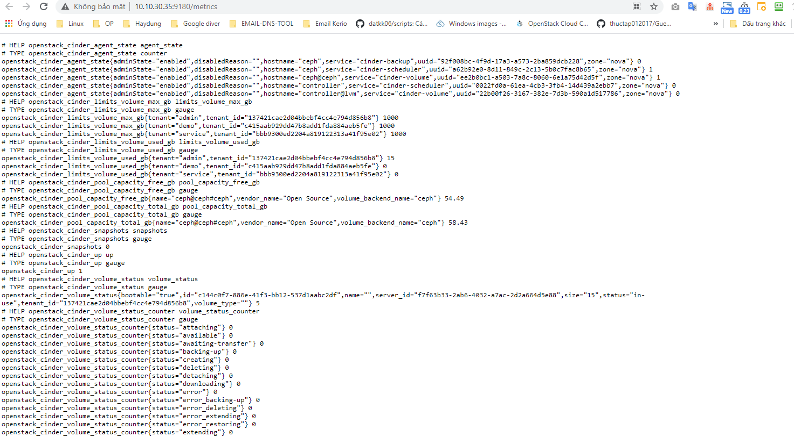

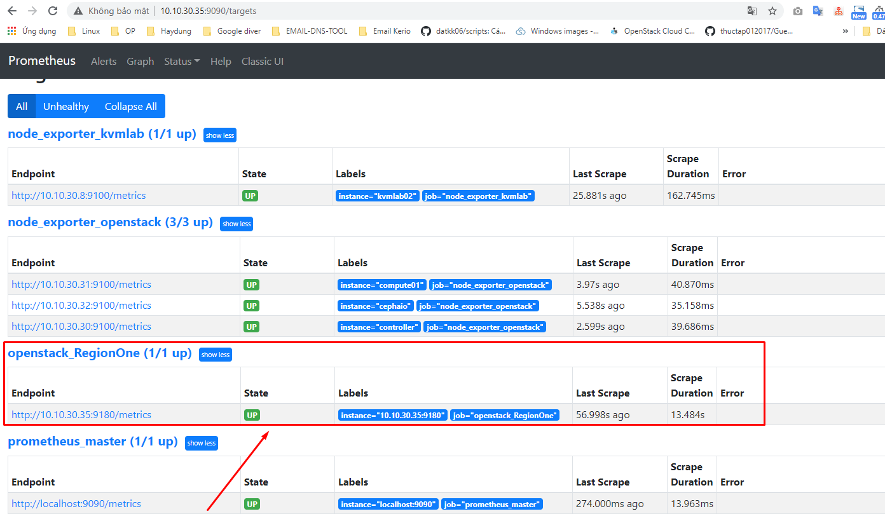


Khi thêm 1 region nữa thì phải sửa cấu hình `/root/.config/openstack/clouds.yml` thêm thông tin của 1 region nữa và khởi tạo thêm 1 openstack exporter để thu thập metrics từ region mới.

```
docker run -v "$HOME/.config/openstack/clouds.yml":/etc/openstack/clouds.yaml -it quay.io/niedbalski/openstack-exporter-linux-amd64:master RegionTwo
```

- Import file json lên grafana tùy chỉnh cấu hình với hệ thống cần monitor

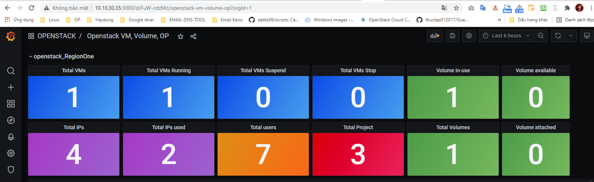

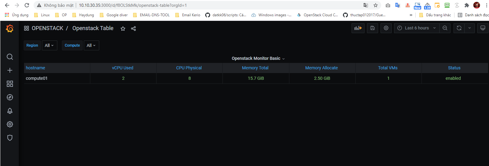

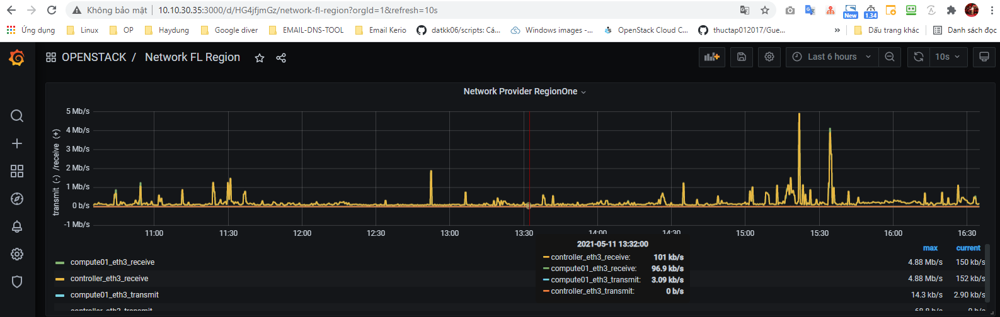

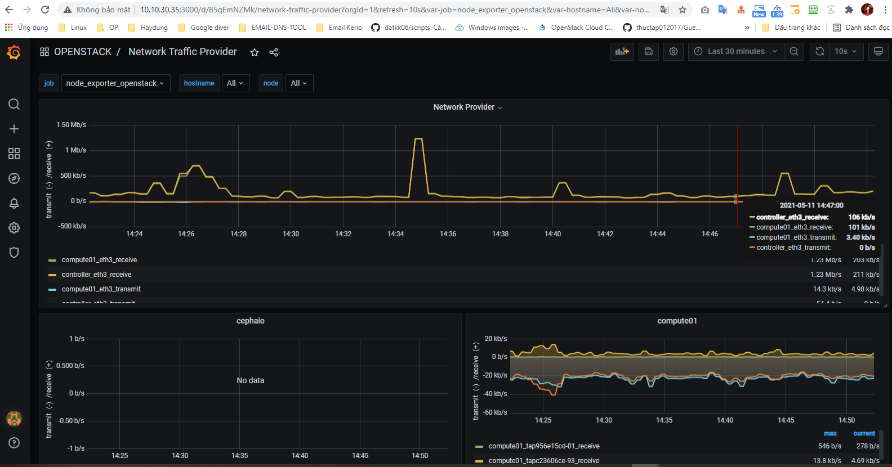


### Tham khảo


https://github.com/openstack-exporter/openstack-exporter


 