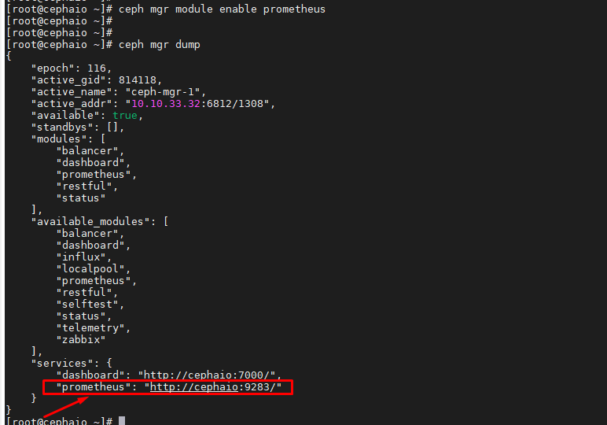
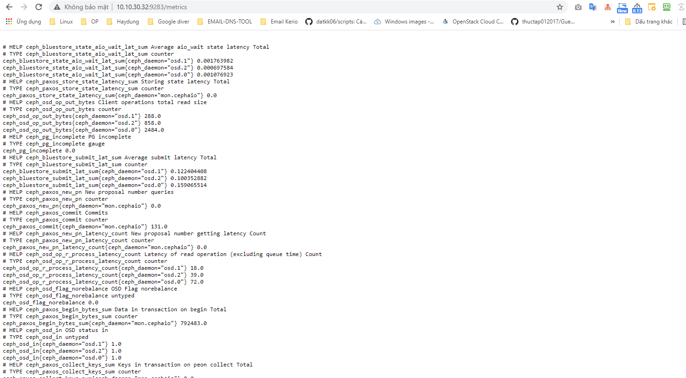
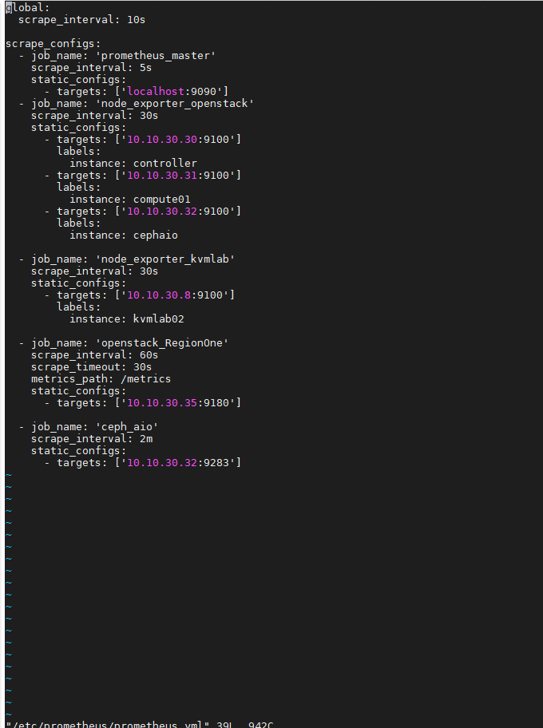
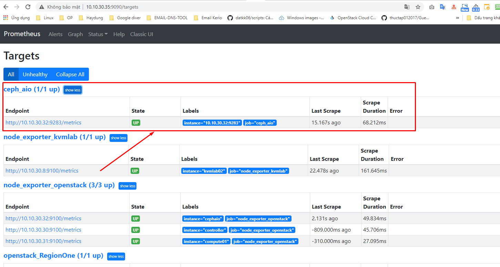
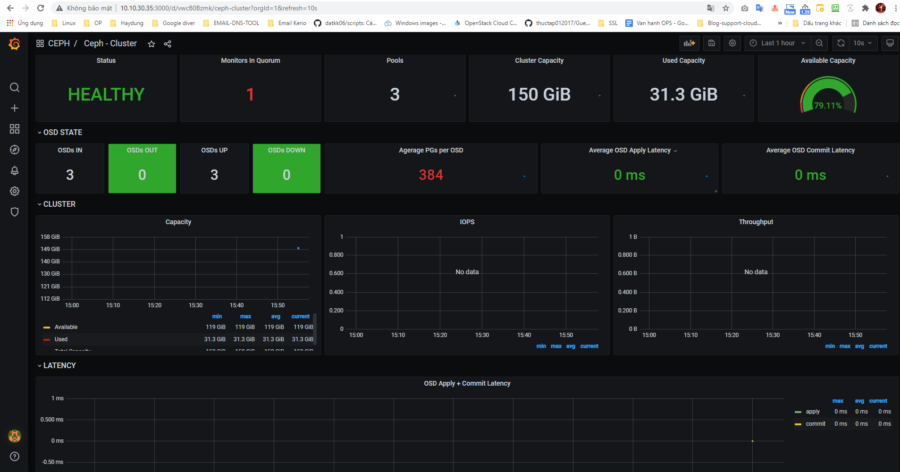
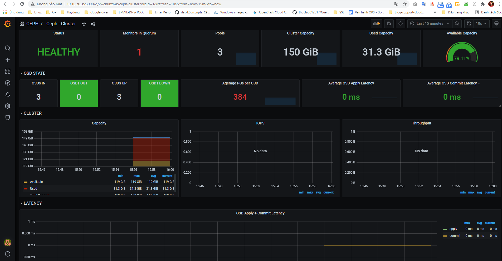

## Monitor một số tham số CEPH sử dụng prometheus

Sử dụng module `prometheus` trong CEPH để lấy metric

- Enable `modules` trong CEPH

```
ceph mgr module enable prometheus
```

```
ceph mgr dump
```



- Truy cập xem metric ceph prometheus

```
http://ip-ceph-server-mgr:9283/metrics
```

```
http://10.10.30.32:9283/metrics
```




- Chỉnh sửa file cấu hình prometheus.yml trên prometheus server

```
vi /etc/prometheus/prometheus.yml
```

Thêm dòng

```
  - job_name: 'ceph_aio'
    scrape_interval: 2m
    static_configs:
      - targets: ['10.10.30.32:9283']
```




```
systemctl restart prometheus
```



- Import file json lên grafana tùy chỉnh cấu hình với hệ thống cần monitor





