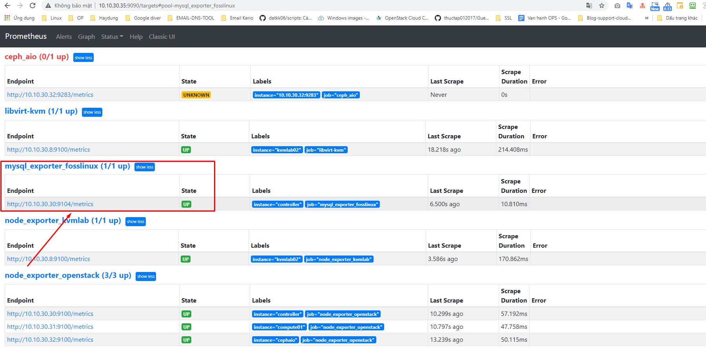

## Monitor một số tham số mysql sử dụng prometheus

###Thao tác trên node chạy mysql

- Login vào mysql và tạo thêm user `mysqld_exporter`

```
mysql -u root -p
```

```
CREATE USER 'mysqld_exporter'@'localhost' IDENTIFIED BY 'StrongPassword' WITH MAX_USER_CONNECTIONS 2;
GRANT PROCESS, REPLICATION CLIENT, SELECT ON *.* TO 'mysqld_exporter'@'localhost';
FLUSH PRIVILEGES;
EXIT
```


- Download mysqld_exporter

Tải node exporter <a href="https://prometheus.io/download/" target="_blank">tại đây!</a>


```
wget https://github.com/prometheus/mysqld_exporter/releases/download/v0.13.0-rc.0/mysqld_exporter-0.13.0-rc.0.linux-amd64.tar.gz
```

- Giải nén package vừa download

```
tar -xvzf mysqld_exporter-0.13.0-rc.0.linux-amd64.tar.gz
```

- Tạo một user cho mysql exporter

```
useradd -rs /bin/false mysqld_exporter
```

- Chuyển binary mysqld_exporter tới `/usr/local/bin` từ package vừa giải nén.
 
```
mv mysqld_exporter-0.13.0-rc.0.linux-amd64/mysqld_exporter /usr/bin
```

- Phân quyền cho file mysqld_exporter

```
chown mysqld_exporter:mysqld_exporter /usr/bin/mysqld_exporter
```

- Tạo folder mysql_exporter

```
mkdir -p /etc/mysql_exporter
```

- Tạo MySQL password file cho mysqld_exporter.

```
vi /etc/mysql_exporter/.mysqld_exporter.cnf
```

Nhập nội dung

```
[client]
user=mysqld_exporter
password=StrongPassword
```

User/password đã tạo thêm trong mysql.

- Phân quyền

```
chown mysqld_exporter:mysqld_exporter /etc/mysql_exporter/.mysqld_exporter.cnf
```

Kiểm tra quyền 644

```
-rw-r--r-- 1 mysqld_exporter mysqld_exporter 54 May 28 15:21 /etc/mysql_exporter/.mysqld_exporter.cnf
```


- Tạo một service file cho node exporter.

```
vi /etc/systemd/system/mysql_exporter.service
```

Thêm nội dung

```
[Unit]
Description=Prometheus MySQL Exporter
After=network.target
User=prometheus
Group=prometheus

[Service]
Type=simple
Restart=always
ExecStart=/usr/bin/mysqld_exporter \
--config.my-cnf /etc/mysql_exporter/.mysqld_exporter.cnf \
--collect.global_status \
--collect.info_schema.innodb_metrics \
--collect.auto_increment.columns \
--collect.info_schema.processlist \
--collect.binlog_size \
--collect.info_schema.tablestats \
--collect.global_variables \
--collect.info_schema.query_response_time \
--collect.info_schema.userstats \
--collect.info_schema.tables \
--collect.perf_schema.tablelocks \
--collect.perf_schema.file_events \
--collect.perf_schema.eventswaits \
--collect.perf_schema.indexiowaits \
--collect.perf_schema.tableiowaits \
--collect.slave_status \
--web.listen-address=0.0.0.0:9104

[Install]
WantedBy=multi-user.target
```

- Reload system daemon

```
systemctl daemon-reload
systemctl enable mysql_exporter
systemctl start mysql_exporter
```

- Xem metrics thu thập được qua node exporter URL.

```
http://IP-Server-Linux:9104/metrics
```

```
http://10.10.30.30:9104/metrics
```


### Thêm config node exporter target trên prometheus server

- Chỉnh sửa file `prometheus.yml` trên prometheus server 

```
vi /etc/prometheus/prometheus.yml
```

Thêm đoạn cấu hình (lưu ý đúng cú pháp yaml)

```
  - job_name: 'mysql_exporter_fosslinux'
    scrape_interval: 30s
    static_configs:
      - targets: ['10.10.30.30:9104']
        labels:
          instance: controller
```


- Restart Prometheus service

```
systemctl restart prometheus
```

- Truy cập xem target server mysql



### Import file json lên grafana tùy chỉnh cấu hình với hệ thống cần monitor


https://github.com/percona/grafana-dashboards/tree/PMM-2.0/dashboards


### Tham khảo

https://computingforgeeks.com/monitoring-mysql-mariadb-with-prometheus-in-five-minutes/

https://www.fosslinux.com/10398/how-to-install-and-configure-prometheus-on-centos-7.htm

https://help.scalegrid.io/docs/mysql-connecting-to-prometheus-and-grafana


