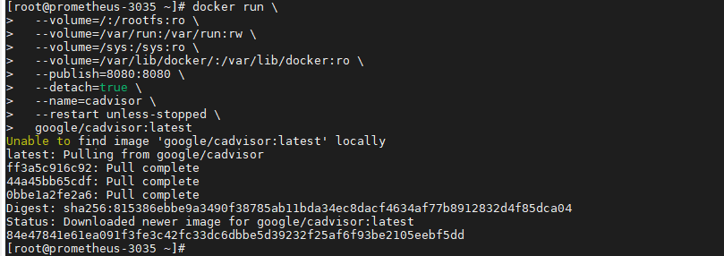
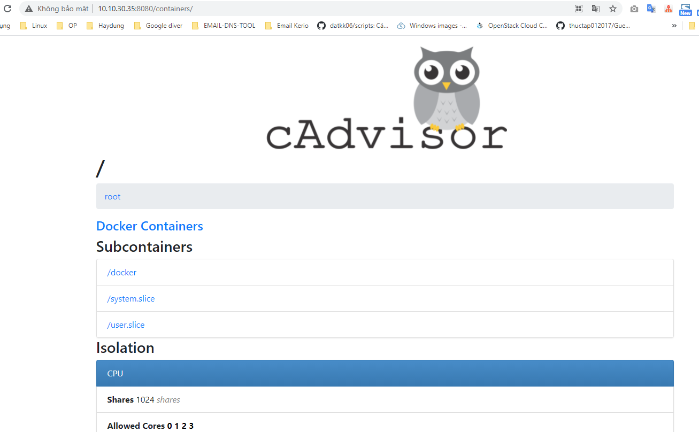
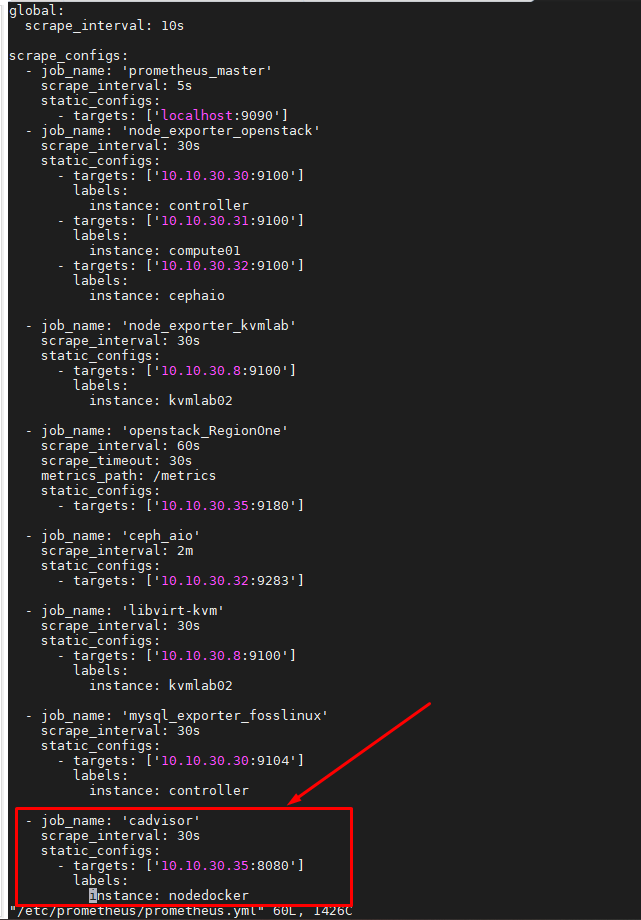
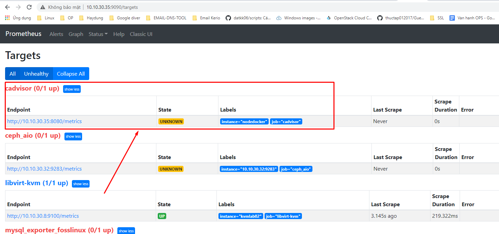
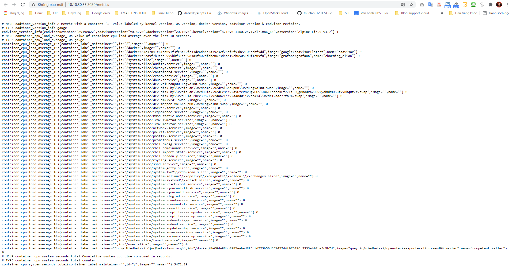
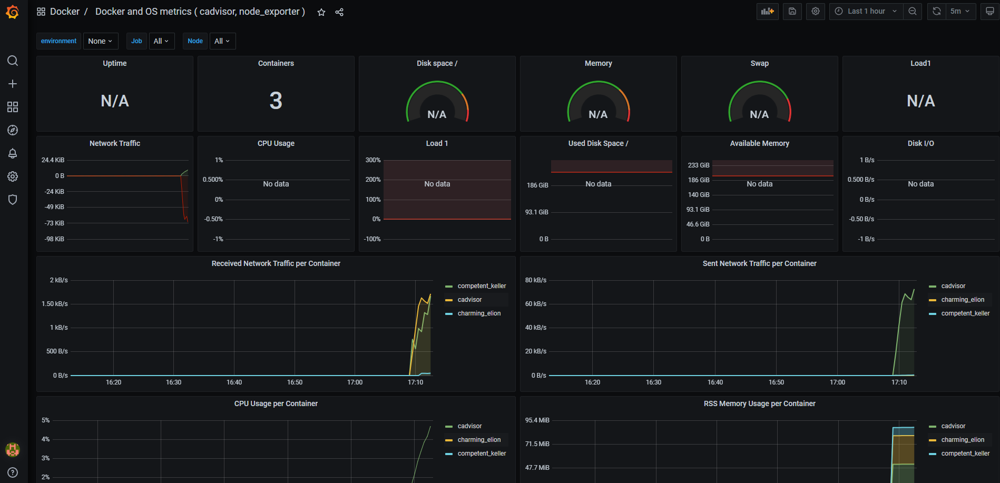
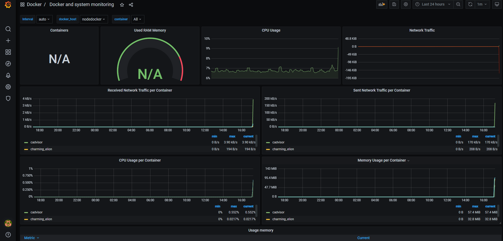

## Monitor một số tham số docker sử dụng prometheus

### Thao tác trên node chạy docker

- Run container cadvisor để collect metrics và expose ra ngoài

```
docker run \
  --volume=/:/rootfs:ro \
  --volume=/var/run:/var/run:rw \
  --volume=/sys:/sys:ro \
  --volume=/var/lib/docker/:/var/lib/docker:ro \
  --publish=8080:8080 \
  --detach=true \
  --name=cadvisor \
  --restart unless-stopped \
  google/cadvisor:latest
```



- Truy cập test

```
http://IP_server_docker:8080/containers/
```

```
http://10.10.30.35:8080/containers/
```



### Thêm config node exporter target trên prometheus server

```
vi /etc/prometheus/prometheus.yml
```

Thêm nội dung

```
  - job_name: 'cadvisor'
    scrape_interval: 30s
    static_configs:
      - targets: ['10.10.30.35:8080']
        labels:
          instance: nodedocker	  
```

- Restart Prometheus service

```
systemctl restart prometheus
```




- Truy cập xem target server mysql



Truy cập xem metrics prometheus thu thập được

```
http://IP_Promethues_server:8080/metrics
```

```
http://10.10.30.35:8080/metrics
```



### Import file json lên grafana tùy chỉnh cấu hình với hệ thống cần monitor

Sử dụng template có sẵn trên trang chu grafana <a href="https://grafana.com/grafana/dashboards/10566" target="_blank">tại đây!</a>





